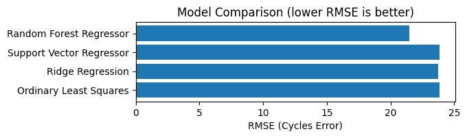
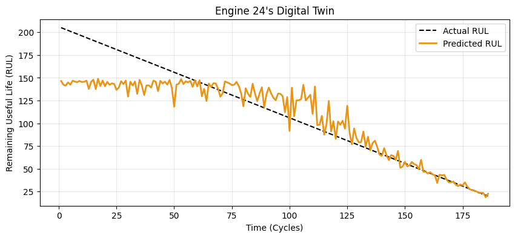
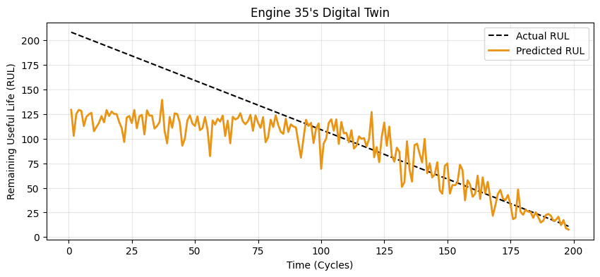

# Digital Twin for Predictive Maintenance — NASA Turbofan Engines

A machine learning project that builds a digital twin for turbofan jet engines by predicting Remaining Useful Life (RUL) from multivariate sensor data. The goal is to enable data-driven maintenance scheduling.

---

## Overview

Aircraft engines degrade over time. By modelling the relationship between sensor readings and remaining operational cycles, we can predict when an engine is likely to fail. This project trains and compares several regression models on the NASA C-MAPSS dataset for digital twin simulation. 

---

## Dataset

**NASA C-MAPSS — FD001**  
Source: [Kaggle — NASA CMAPS](https://www.kaggle.com/datasets/behrad3d/nasa-cmaps?resource=download&select=CMaps)

| File | Description |
|------|-------------|
| `train_FD001.txt` | Engines run to fault |
| `test_FD001.txt`  | Sensor readings up to a censored point. These engines are not run to fault |
| `RUL_FD001.txt`   | Ground-truth RUL for the last recorded cycle of each test engine in test_FD001.txt |

The dataset contains 100 engines, each with 21 sensors readings and 3 operational settings across multiple cycles.

```
datasets/
├── Train/train_FD001.txt
├── Test/test_FD001.txt
└── RUL_FD001.txt
```

---

## Data Preprocessing

### Feature Pruning
Constant or near-constant variables were removed:
`op_1`, `op_2`, `op_3`, `sensor_1`, `sensor_10`, `sensor_18`, `sensor_19`

### RUL Target Construction
For each row in the training set, RUL is computed as:

```
RUL = last_cycle − current_cycle
```

RUL is saturated at 150 cycles to prevent the model from overfitting to large RUL values when the engine is healty— early-life predictions are less critical for maintenance decisions than near-failure predictions.

### Normalisation
All remaining sensor columns are standardised using `StandardScaler` (fit on training data, applied to both train and test sets) to bring features onto a comparable scale.

### Train / Test Split
- **Train**: all rows from `train_FD001.txt` with computed RUL labels
- **Test**: the last recorded cycle per engine in `test_FD001.txt`, correspond to `RUL_FD001.txt`

---

## Models

Four regression models are trained and evaluated:

| Model | RMSE | R2 |
|-------|-------|-------|
| **Ordinary Least Squares (OLS)** | 23.88 | 66.99% |
| **Ridge Regression** | 23.75 | 67.32% |
| **Support Vector Regressor (SVR)** | 23.84 | 67.08% |
| **Random Forest Regressor** | 21.49 | 73.26% |

---

##  Evaluation Metrics

| Metric | Description |
|--------|-------------|
| **RMSE** | Root Mean Squared Error — cycle-level prediction error (lower is better) |
| **R²** | Proportion of RUL variance explained by the model (higher is better) |

Model RMSE scores are compared in a horizontal bar chart. Hyperparameter search results for Random Forest are visualised as RMSE and R² heatmaps across `(n_estimators, max_depth)` grids.

### Model Comparison



---

## Digital Twin Simulation




## Project Structure

```

├── datasets/
│   ├── Train/train_FD001.txt
│   ├── Test/test_FD001.txt
│   └── RUL_FD001.txt
├── figures/
└── Predictive_Maintenance_for_NASA_Turbofan_Engines.ipynb
```

##  Requirements

```
numpy
pandas
matplotlib
seaborn
scikit-learn
```

Install dependencies:

```bash
pip install numpy pandas matplotlib seaborn scikit-learn
```

##  Usage

1. Download the dataset from Kaggle(https://www.kaggle.com/datasets/behrad3d/nasa-cmaps) and place it in the `datasets/` folder as shown above in `Project Structure`.
2. Open the notebook:
   ```bash
   jupyter notebook Predictive_Maintenance_for_NASA_Turbofan_Engines.ipynb
   ```
3. Run all cells.
